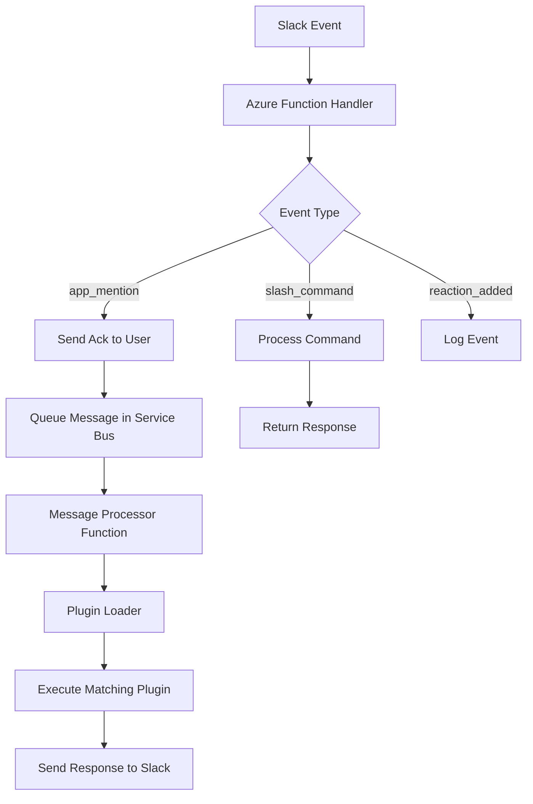
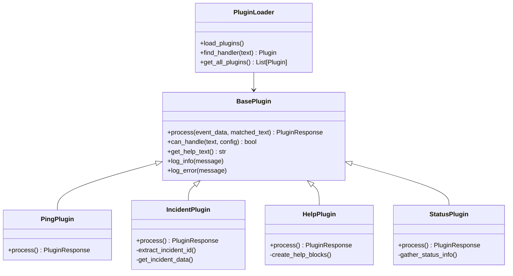
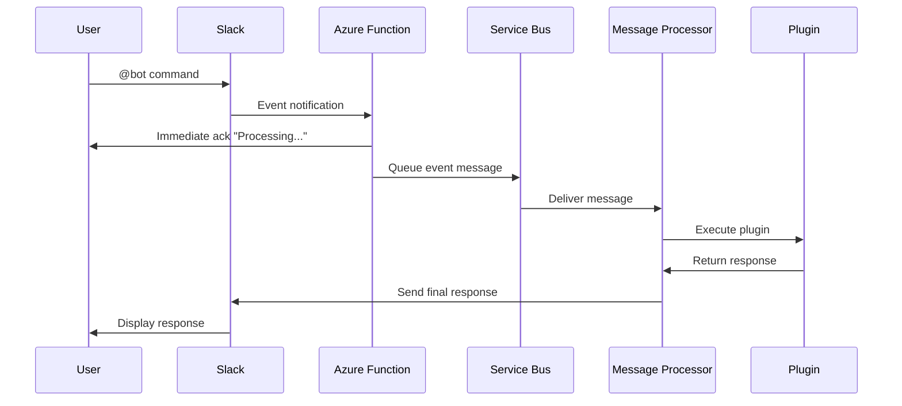

# Slack Bot

A serverless Slack bot built with Python and Azure Functions, featuring an asynchronous plugin-based architecture for scalable message processing.

## Overview

This Slack bot provides a robust, scalable solution for handling Slack events and commands. It uses Azure Service Bus for asynchronous message processing to avoid Slack's 3-second timeout limitations and supports a modular plugin system for easy extensibility.

## Architecture

The bot follows a decoupled architecture pattern:



## Features

- **Asynchronous Processing**: Uses Azure Service Bus to handle long-running operations
- **Plugin System**: Modular plugin architecture for easy feature expansion
- **Deduplication**: Built-in message deduplication to prevent duplicate responses
- **Multiple Response Types**: Support for channel messages, direct messages, and threaded responses
- **Slash Commands**: Built-in slash command support (/hello, /info, /help)
- **Event Handling**: Comprehensive Slack event processing (mentions, reactions, etc.)
- **Monitoring**: Structured logging and debugging endpoints

## Quick Start

### Prerequisites

- Python 3.8+
- Azure account (for production deployment)
- Slack workspace with admin permissions

### Local Development Setup

1. Clone the repository:
```bash
git clone <repository-url>
cd slack-bot
```

2. Create virtual environment:
```bash
python -m venv venv
source venv/bin/activate  # On macOS/Linux
# or
venv\Scripts\activate     # On Windows
```

3. Install dependencies:
```bash
pip install -r requirements.txt
```

4. Configure environment variables:
```bash
cp .env.template .env
# Edit .env with your Slack tokens
```

5. Run locally:
```bash
python src/app.py
```

### Azure Functions Setup

1. Copy local settings:
```bash
cp local.settings.json.template local.settings.json
# Edit with your configuration
```

2. Start Azure Functions locally:
```bash
func start
```

3. Deploy to Azure:
```bash
func azure functionapp publish <your-function-app-name>
```

## Plugin System

The bot uses a YAML-based plugin configuration system that allows easy addition of new features:



### Available Plugins

- **Ping Plugin**: Simple connectivity test
- **Incident Plugin**: Retrieve incident information by ID
- **Help Plugin**: Display available commands and usage
- **Status Plugin**: Show bot health and system metrics

### Creating Custom Plugins

1. Create a new plugin file in the `plugins/` directory
2. Extend the `BasePlugin` class
3. Add plugin configuration to `plugins.yaml`
4. Implement the `process()` method

Example plugin structure:
```python
class MyPlugin(BasePlugin):
    def process(self, event_data: Dict[str, Any], matched_text: str) -> Optional[PluginResponse]:
        # Your plugin logic here
        return PluginResponse(
            text="Response text",
            response_type="channel"
        )
```

## Message Flow

The following diagram shows how messages are processed:



## Configuration

### Environment Variables

| Variable | Description | Required |
|----------|-------------|----------|
| `SLACK_BOT_TOKEN` | Bot user OAuth token (xoxb-) | Yes |
| `SLACK_SIGNING_SECRET` | Request verification secret | Yes |
| `SLACK_APP_TOKEN` | App-level token for Socket Mode (xapp-) | Development |
| `SERVICE_BUS_CONNECTION_STRING` | Azure Service Bus connection | Production |
| `APP_NAME` | Bot display name | No |
| `LOG_LEVEL` | Logging level (DEBUG, INFO, WARNING, ERROR) | No |

### Plugin Configuration (plugins.yaml)

```yaml
plugins:
  - name: "ping"
    module: "plugins.ping"
    patterns: ["ping"]
    description: "Simple ping-pong response"
    enabled: true
```

## Monitoring and Debugging

The bot includes several debugging endpoints:

- `/api/debug/env` - Display environment variables
- `/api/debug/plugins` - Test plugin matching
- `/api/debug/dedup-stats` - View deduplication statistics

## Deployment

### Azure Functions Deployment

1. Create Azure resources:
   - Function App
   - Service Bus Namespace and Queue
   - Application Insights (optional)

2. Configure environment variables in Azure

3. Deploy using Azure Functions Core Tools:
```bash
func azure functionapp publish <app-name>
```

### Slack App Configuration

For production deployment:
1. Disable Socket Mode in your Slack app
2. Set Event Request URL to: `https://<your-app>.azurewebsites.net/api/slack/events`
3. Set Slash Command URLs to: `https://<your-app>.azurewebsites.net/api/slack/commands`

## Development

### Project Structure

```
slack-bot/
├── src/
│   ├── handlers/          # Event and command handlers
│   ├── services/          # Business logic services
│   ├── utils/             # Utility functions
│   ├── config/            # Configuration management
│   └── plugins/           # Plugin system
├── plugins/               # Individual plugin implementations
├── tests/                 # Test suite
├── function_app.py        # Azure Functions entry point
├── plugins.yaml           # Plugin configuration
└── requirements.txt       # Python dependencies
```

### Testing

```bash
# Run tests
pytest

# Run with coverage
pytest --cov=src

# Run specific test file
pytest tests/test_plugins.py
```

### Code Quality

```bash
# Format code
black src/ plugins/

# Sort imports
isort src/ plugins/

# Lint code
flake8 src/ plugins/
```

## Contributing

Contributions are welcome! Please:

1. Fork the repository
2. Create a feature branch
3. Make your changes
4. Add tests if applicable
5. Run code quality checks
6. Submit a pull request

## Troubleshooting

### Common Issues

**Bot not responding to mentions:**
- Check that `app_mentions:read` scope is added
- Verify bot is added to the channel
- Check Azure Function logs

**Duplicate messages:**
- Review deduplication logs at `/api/debug/dedup-stats`
- Check Service Bus message deduplication settings

**Plugin not loading:**
- Verify plugin is listed in `plugins.yaml`
- Check plugin file syntax
- Review function logs for import errors

### Support

For issues and questions:
1. Check the troubleshooting section
2. Review Azure Function logs
3. Use debug endpoints for diagnostics
4. Create an issue in the repository

## License

This project is open source and available under the [MIT License](LICENSE).
